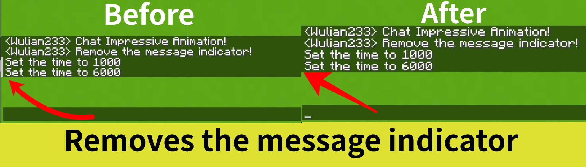
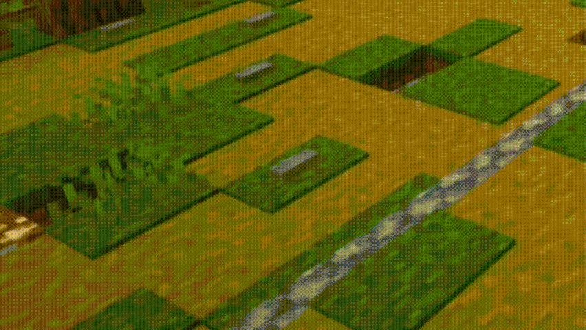

# 聊动魅影

[English](README.md) 简体中文

本模组是[Chat Animation](https://github.com/Ezzenix/ChatAnimation) 的非官方多平台移植版。

添加了一些关于聊天栏的动画，如打开聊天栏，发送消息等。同时删除了提示类消息左侧的白条

## 📖 这个模组是什么？

聊动魅影（英文缩写CIA）是[Chat Animation](https://github.com/Ezzenix/ChatAnimation)的非官方移植版，现可在Fabric和Neoforge使用。

对于1.20.4及更低的mc版本，还提供了Forge的支持，但不支持消息发送动画。

这个模组添加了一些关于聊天栏的动画，如打开聊天栏，发送消息等。同时删除了提示类消息左侧的白条

## ✅  功能

- 打开聊天栏动画
- 关闭聊天栏动画
- 消息发送动画（不支持Forge）
- 删除提示类消息左侧的白条（于mc 1.19.1加入）

## ✨ 截图

## 👀 协议

此模组使用[MIT许可证](LICENSE)
